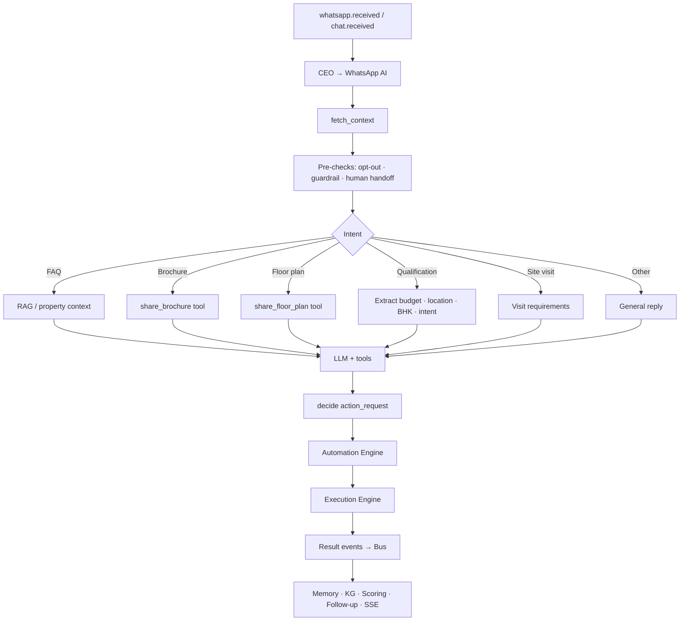
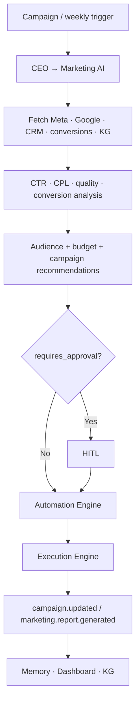
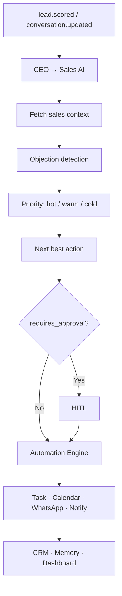
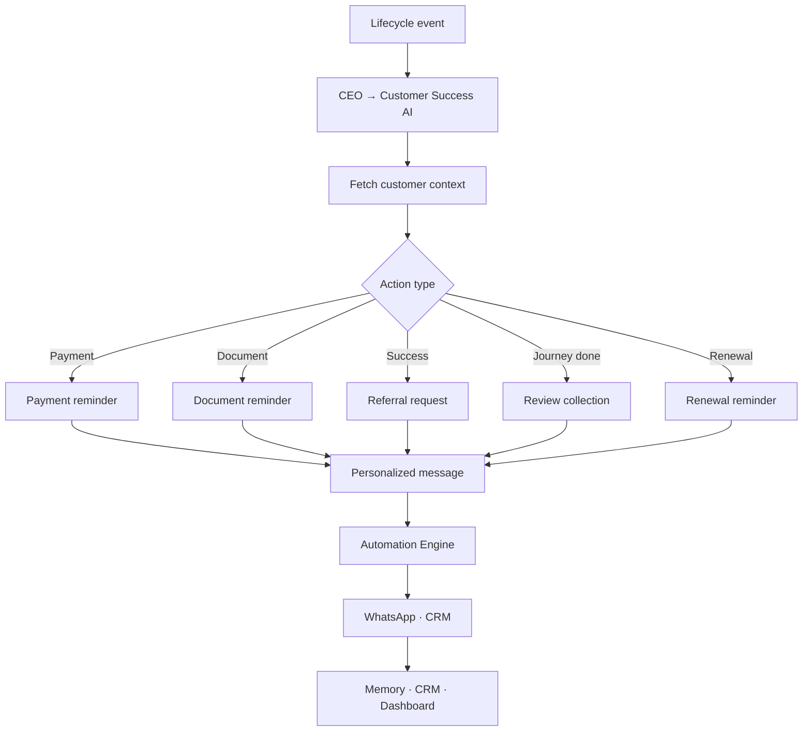
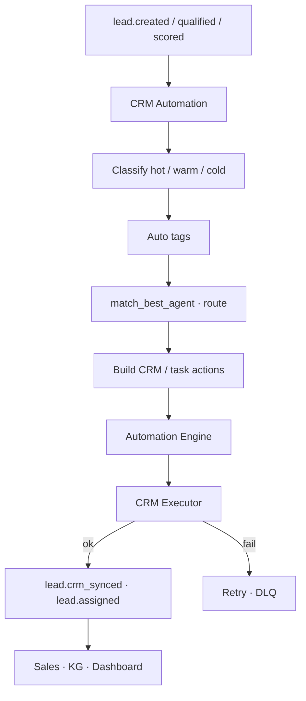
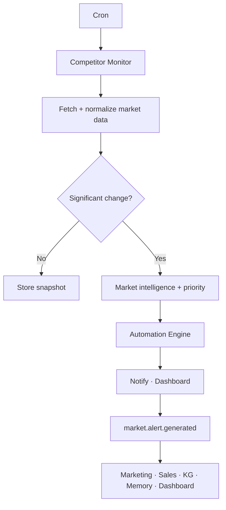
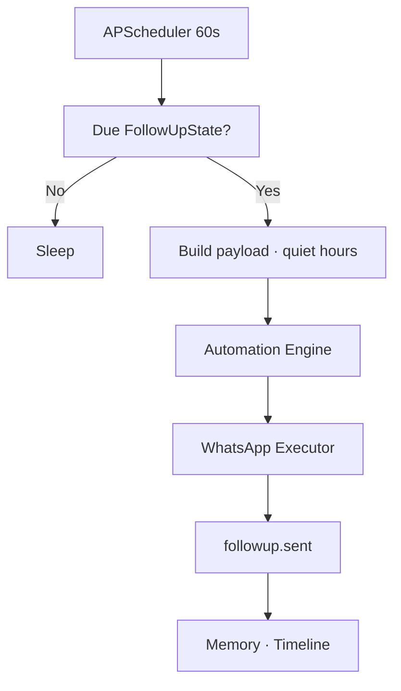
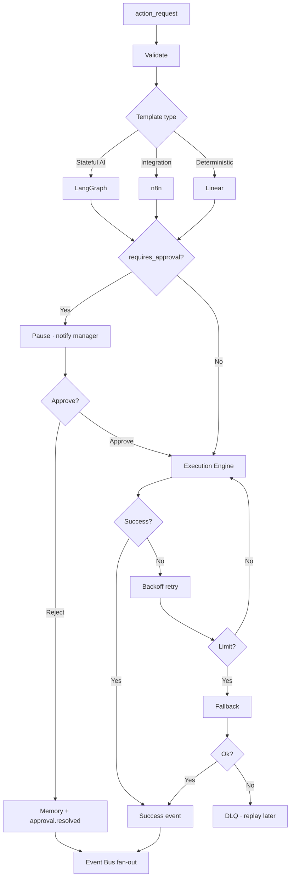

# IREIOS 3.0 — AI Automation Workflows

Per-agent and per-workflow **behavior** only.

| This doc owns | Does not own |
|---|---|
| Intents, context, decisions, action types, published events per workflow | System layers / Path A–E topology → `IREIOS_3.0_Architecture_Diagrams.md` |
| | File trees, phases, migration → `IREIOS_3.0_IMPLEMENTATION_PLAN.md` |

**Universal pattern (all workflows):**

```text
Trigger event → CEO routes → Agent/Workflow
  → fetch_context → analyze → decide (action_request)
  → Automation Engine (validate · template · HITL if needed)
  → Execution Engine (executor)
  → result event → Event Bus → Memory · KG · Dashboard · next agents
```

Event names must match the **Architecture Diagrams event catalog**.

---

## 1. WhatsApp AI Workflow

**Role:** Inbound WhatsApp (and website chat via same agent path): qualification, FAQ, brochure, floor plan, site visit, reminders handoff, escalation.

| | |
|---|---|
| **Inputs** | `whatsapp.received`, `chat.received` |
| **Context** | Lead, session messages, FollowUpState, FAISS RAG, Memory, Neo4j lead/project links |
| **Outputs (actions)** | `send_whatsapp`, `send_whatsapp`+media, `update_crm` / lead fields, `schedule_visit`, `escalate_to_human` |
| **Publishes** | Via EE: `whatsapp.sent`, `brochure.sent`, `floorplan.sent`, `site_visit.scheduled`; agent side: `whatsapp.response.generated`, `lead.qualified` when criteria met |

### Flow



### Intent rules (summary)

| Intent | Behavior |
|---|---|
| FAQ | Answer from RAG / property context; no document tool |
| Brochure | Explicit brochure/catalog/PDF ask → `share_brochure` → media send |
| Floor plan | Layout/map/dimensions ask → `share_floor_plan` → media send |
| Qualification | Extract fields; if incomplete, one clarifying question; if complete → qualify path |
| Site visit | Collect requirements → `schedule_visit` (HITL if policy requires) |
| Escalation | Opt-out / human request / guardrail → `escalate_to_human` |

### Multi-turn (Path B)

Same workflow; memory skips known fields until qualification complete.

---

## 2. Marketing AI Workflow

**Role:** Campaign performance, audience/budget suggestions, reports.

| | |
|---|---|
| **Inputs** | `campaign.completed`, `cron.weekly_report`, `market.alert.generated` (optional) |
| **Context** | Meta/Google metrics, CRM lead quality, conversions, KG |
| **Outputs** | `notify_admin`, ads API actions (when integrated), report publish |
| **Publishes** | `marketing.report.generated`, `campaign.updated` |
| **HITL** | Budget/campaign changes that spend money → `requires_approval` |



---

## 3. Sales AI Workflow

**Role:** Objections, priority, next-best-action, hot-lead awareness.

| | |
|---|---|
| **Inputs** | `lead.scored`, `conversation.updated`, `lead.hot` |
| **Context** | Lead profile, history, prior objections, score, site visits |
| **Outputs** | `create_task`, `schedule_visit`, `send_whatsapp` (docs), `notify_agent` |
| **Publishes** | Sales action result events; may set `requires_approval` (e.g. discount) |
| **HITL** | High-risk commercial actions |



### Next-best-action examples

| Priority / signal | Action |
|---|---|
| Hot + engaged | Call task / site visit |
| Price objection | Negotiation path or human task (HITL if discount) |
| Warm | Brochure/floor plan or timed follow-up |
| Cold | Low-touch follow-up later |

---

## 4. Customer Success AI Workflow

**Role:** Lifecycle messaging after booking/payment.

| | |
|---|---|
| **Inputs** | `payment.due`, `payment.received`, `document.pending`, `booking.confirmed`, `customer.onboarded`, `renewal.due` |
| **Context** | Customer profile, payment/document status, booking history |
| **Outputs** | `send_whatsapp`, `update_crm` |
| **Publishes** | CS result events (e.g. reminder sent) |



---

## 5. CRM Automation Workflow

**Role:** Deterministic classification, tags, agent match, routing, CRM sync (not LLM-first).

| | |
|---|---|
| **Inputs** | `lead.created`, `lead.qualified`, `lead.scored` |
| **Context** | Lead fields, score, budget alignment, location, agent availability |
| **Outputs** | `update_crm`, `create_task`, assignment fields |
| **Publishes** | `lead.crm_synced`, `lead.assigned` |
| **Failure** | EE retry → DLQ (Path D) |



---

## 6. Competitor Monitoring Workflow

**Role:** Scheduled market intelligence (Layer 10).

| | |
|---|---|
| **Inputs** | APScheduler / cron (not bus-first) |
| **Context** | Pricing, projects, offers, inventory, news, infrastructure snapshots |
| **Outputs** | `notify_admin`, dashboard alert actions |
| **Publishes** | `market.alert.generated` |



---

## 7. Follow-Up Scheduler Workflow

**Role:** Time-based Day 0→1→3→7 style follow-ups (Path E). Polling is intentional.

| | |
|---|---|
| **Inputs** | APScheduler every ~60s; also `lead.created` / activity to arm state |
| **Context** | `FollowUpState`, lead, quiet hours, intelligence payload builders |
| **Outputs** | `send_whatsapp` via AE→EE (never direct Twilio) |
| **Publishes** | `followup.sent` |



---

## 8. Automation Engine Workflow (shared)

**Role:** Layer 6 control plane for every action_request.

| | |
|---|---|
| **Inputs** | Action requests from any agent/workflow |
| **Does** | Validate → load template → LangGraph \| n8n \| linear → HITL gate → call EE → retry/fallback/DLQ |
| **Publishes** | Success/failure/approval events; never skips EE for external I/O |



---

## 9. Lead Scoring Handler (async)

**Role:** Non-blocking ML after chat (keeps WA latency low).

| | |
|---|---|
| **Inputs** | `whatsapp.response.generated` (and optionally `lead.qualified`) |
| **Does** | `calculate_lead_score`, budget alignment, related intelligence |
| **Publishes** | `lead.scored`; if threshold → `lead.hot` |

Not a conversational agent; registered handler under CEO/bus.

---

## 10. Former placeholders → active agents (Wave C)

`PLACEHOLDER_AGENTS` is **empty**. The six Layer-2 names are **active** bus agents (see `AGENTS.md`):

| Agent | Typical inputs | Notes |
|-------|----------------|--------|
| `negotiation_agent` | `lead.negotiation.*` | HITL when budget misaligned |
| `pricing_agent` | `pricing.query`, `lead.scored` | `PricingRule` lookup |
| `inventory_agent` | `inventory.query` / hold | `InventoryUnit` available |
| `onboarding_agent` | `booking.confirmed`, `customer.onboarded` | Welcome WA checklist |
| `finance_agent` | `payment.query`, `finance.schedule` | Payment info via AE |
| `legal_agent` | `document.required`, `legal.review` | Doc needs → notify |

Former `retention_agent` duties are covered by `customer_success_agent`.

---

## 11. Workflow ↔ event index

| Workflow | Primary inputs | Primary outputs / events |
|---|---|---|
| WhatsApp AI | `whatsapp.received`, `chat.received` | `whatsapp.sent`, `brochure.sent`, `floorplan.sent`, `lead.qualified`, `whatsapp.response.generated` |
| Marketing AI | `campaign.completed`, cron | `marketing.report.generated`, `campaign.updated` |
| Sales AI | `lead.scored`, `conversation.updated`, `lead.hot` | tasks, visits, notifications (+ HITL) |
| Customer Success | payment/booking/lifecycle events | reminders, CRM updates |
| CRM Automation | `lead.created`, `lead.qualified`, `lead.scored` | `lead.assigned`, `lead.crm_synced` |
| Competitor Monitor | cron | `market.alert.generated` |
| Follow-Up Scheduler | cron + lead activity | `followup.sent` |
| Automation Engine | action_request | success/fail/approval events |
| Lead Scoring | `whatsapp.response.generated` / `conversation.updated` | `lead.scored`, `lead.hot` (closeout: ensure `lead.hot` actually published) |

---

## 12. n8n side-plane (not CEO agents)

n8n is **outside** the in-process CEO table. Delivery = **`n8n_bridge`** (group `ireios-n8n` → webhooks) or AE `template_type=n8n` fallback — not stock Redis Streams.

| n8n workflow | Bus / trigger | Notes |
|--------------|---------------|-------|
| Hot lead **Gmail** | `lead.hot` via **bridge** → `ireios_hot_lead_alert` | `payload.trigger` = threshold \| handoff |
| Visit fan-out Gmail | `site_visit.scheduled` → `ireios_visit_fanout` | No 2nd Google create if `provider=google_calendar` |
| HITL notify Gmail | `approval.requested` → `ireios_hitl_notify` | Dashboard deep links |
| External CRM | `lead.qualified` → `ireios_crm_note` | `chat_context` (BA-2) |
| DLQ alert | n8n cron | Not a bus event |

**Delivery:** `n8n_bridge` (group `ireios-n8n`), not stock Redis Streams.  
**Do not** move follow-up FSM, escalation cron, or WA TwiML into n8n.  
Contracts: `docs/N8N_INTEGRATION.md`, `plans/phase3/N8N_LIVE_WORKFLOWS_PLAN.md`, `plans/phase3/PHASE3_AUTOMATIONS_CLOSEOUT.md`.
