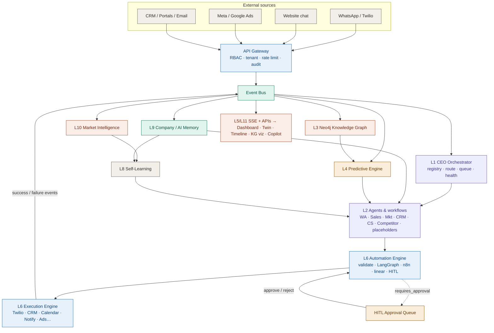
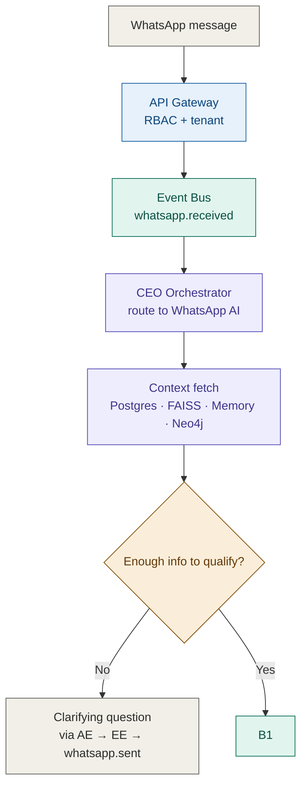
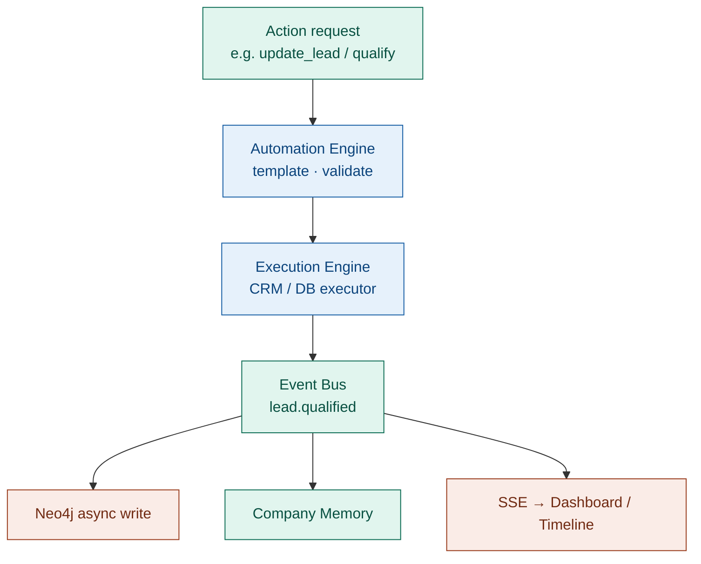
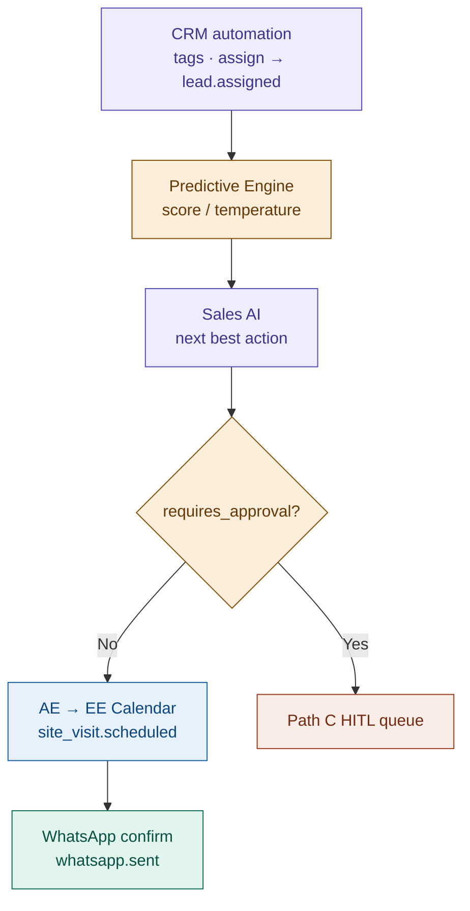
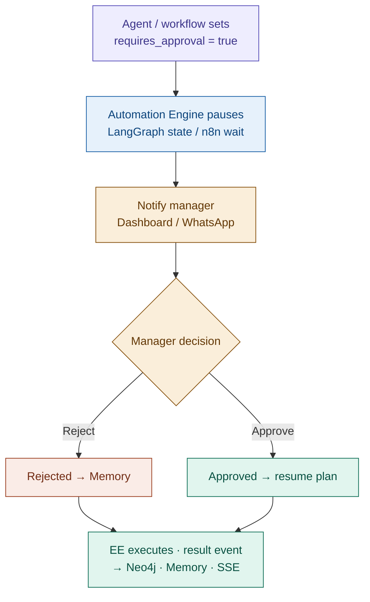
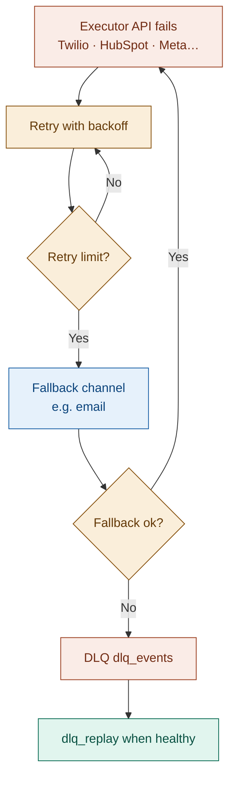
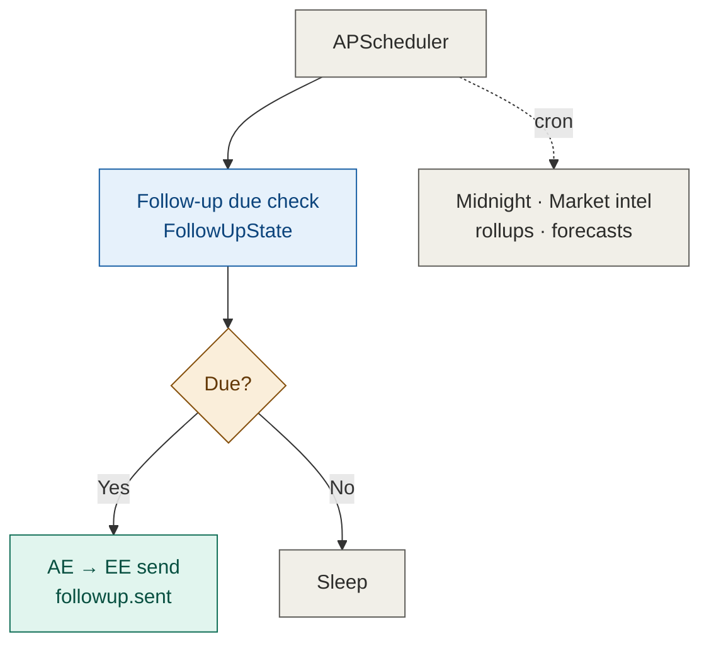
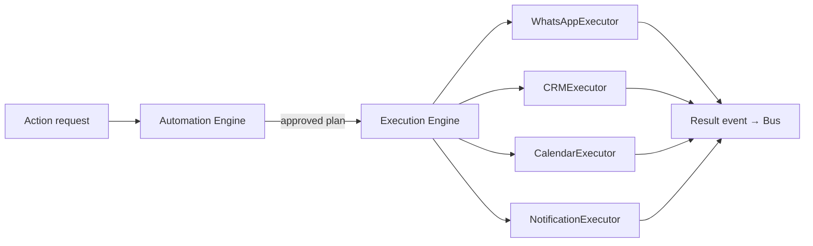

# IREIOS 3.0 — Architecture Diagrams

Canonical **system architecture** for Imperion Real Estate Intelligence OS (Phase 3.0).

| This doc owns | Sibling docs own |
|---|---|
| Layers 1–11, components, Path A–E, event catalog, KG overview, tech map | **Workflows** → `IREIOS_3.0_AI_Automation_Workflows.md` |
| | **Implementation** → `IREIOS_3.0_IMPLEMENTATION_PLAN.md` |
| | **Step-by-step** → `IREIOS_3.0_STEP_BY_STEP_EXPANSION.md` |
| | **Execution order** → `UNIFIED_EXECUTION_ORDER.md` |

Sources: Phase 3 direction assignment (PDF), multi-agent overview (JPEG), refined Path A–E design.

Diagrams use [Mermaid](https://mermaid.js.org). Preview: VS Code **Markdown Preview Mermaid Support**, or [mermaid.live](https://mermaid.live).

---

## Legend

| Color | Meaning |
|---|---|
| Gray | Infrastructure / triggers / neutral |
| Blue | Data & execution (API gateway, engines, writes) |
| Teal | Events / message bus / memory bus |
| Purple | AI agents / CEO orchestrator |
| Amber | Decisions / scoring / approval gates |
| Coral | Fan-out, failure, escalation, HITL reject |

---

## 1. Canonical layers (PDF contract)

Joint deliverable layers. Numbers below are **authoritative** for planning and APIs.

| Layer | Name | Backend (this repo) | Frontend (Mayank) |
|---|---|---|---|
| **1** | CEO AI Orchestrator | Agent registry, scheduler, task queue, agent memory hooks, health, communication bus | — |
| **2** | AI Agents | Full: WhatsApp, Sales, Marketing, CRM automation, Customer Success, Competitor (+ handlers). Placeholders for remaining of “15” | Surfaces via dashboard / copilot |
| **3** | Knowledge Graph | Neo4j schema, relationships, Graph APIs, query engine, versioned schema, async writers | KG visualization |
| **4** | Forecast / Predictive Engine | Lead score, booking, revenue, cancel risk, cashflow, inventory APIs (build on `app/intelligence`) | Forecast widgets |
| **5** | Digital Twin MVP | Event/SSE feeds + graph snapshots | Digital Twin UI |
| **6** | Autonomous Execution | **Automation Engine** + **Execution Engine** (n8n, LangGraph, templates, retry, fallback, HITL) | Approval UI hooks |
| **7** | Negotiation AI (prototype) | Placeholder agent + workflow hook | — |
| **8** | Self-Learning | Feedback loops into models/playbooks (incremental) | — |
| **9** | Company / AI Memory | Conversation, long-term, decision, action memory + context retrieval | Timeline / memory views |
| **10** | Market Intelligence | Competitor monitoring + alerts | Market panels |
| **11** | Executive Command Interface | Prediction + SSE + chat APIs | Dashboard, AI Chat, Command Center |

**Product story flow (JPEG):** sources → lead in → qualify/store → CEO → actions → dashboard, with agents ↔ graph ↔ predictive ↔ execution ↔ memory ↔ market intel ↔ self-learning. Same system; PDF layer IDs above are used in code and docs.

---

## 2. System overview



### Core runtime rule

```
Event → CEO routes → Agent decides → Automation Engine plans/HITL → Execution Engine acts → Event → fan-out
```

No silent side effects: external writes go through **Execution Engine** and publish result events.

---

## 3. Component inventory

| Component | Role | Tech (target) |
|---|---|---|
| API Gateway | Auth, RBAC, tenant, webhooks, public/prediction APIs | FastAPI `main.py` |
| Event Bus | Pub/sub nervous system (durable) | **Redis Streams from Day 1** (consumer groups; n8n-subscribable) |
| CEO Orchestrator | Registry, route by event/policy, task queue, health, agent comms | Python `app/orchestrator` |
| Agents (L2) | Stateless: fetch context → analyze → decide (action request) | `app/agents` |
| Workflows | Deterministic automations (CRM tags, follow-up poll, competitor cron) | `app/workflows` |
| Automation Engine | Validate action, load template, LangGraph / n8n / linear, HITL pause/resume | `app/automation_engine` + n8n + LangGraph |
| Execution Engine | Dumb executors: API call in → success/error out | `app/execution_engine` |
| Knowledge Graph | Entities + relationships; query APIs; async ingest from events | Neo4j + `app/knowledge_graph` |
| AI / Company Memory | Conversation, long-term, decision, action; retrieval for agents | Postgres + vectors (FAISS/embeddings) + graph context |
| Predictive Engine | Scoring & forecast APIs | `app/intelligence` + HTTP surface |
| Market Intelligence | Competitor / demand signals | Workflow + events |
| SSE / realtime | Pulse dashboard, timeline, twin | FastAPI SSE → frontend |
| DLQ + replay | Failed external calls | `dlq_events` + `dlq_replay.py` |
| Scheduler | Time-based work outside pure event path | APScheduler |

---

## 4. Event catalog (canonical)

Names are stable contracts across backend, AE/EE, Neo4j writers, and FE.

### 4.1 PDF-required business events

| Event | When | Typical consumers |
|---|---|---|
| `lead.created` | New lead row / first contact | CRM automation, Memory, KG, Follow-up |
| `lead.assigned` | Human/AI agent assignment | Sales, Dashboard, KG |
| `whatsapp.sent` | Outbound WA delivered/accepted by executor | Memory, Timeline, KG |
| `call.made` | Call logged | Memory, KG, Sales |
| `site_visit.scheduled` | Visit booked | Calendar result, Memory, KG, Sales |
| `booking.confirmed` | Booking done | CS, Memory, KG, Predictive |
| `payment.received` | Payment recorded | CS, Memory, KG, Predictive |

### 4.2 Runtime / pipeline events

| Event | When | Typical consumers |
|---|---|---|
| `whatsapp.received` | Inbound WA webhook accepted | CEO → WhatsApp AI |
| `chat.received` | Website chat message | CEO → WhatsApp/Chat AI |
| `lead.qualified` | Enough fields for qualification | CRM automation, Predictive, Sales |
| `lead.scored` | Score/temperature updated | Sales, Dashboard |
| `lead.hot` | High-intent threshold **or** explicit human handoff | Notification, Sales, n8n |
| `lead.negotiation.started` | User mentions negotiation OR budget misaligned | Negotiation agent, HITL, Dashboard |
| `lead.crm_synced` | CRM executor success | KG, Dashboard |
| `followup.sent` | Scheduled follow-up sent | Memory, Timeline |
| `whatsapp.response.generated` | Agent finished reply analysis (async side work) | Lead scoring handler |
| `brochure.sent` / `floorplan.sent` | Document media sent | Memory, Timeline, KG |
| `market.alert.generated` | Competitor/intel alert | Marketing, Sales, Dashboard |
| `approval.requested` / `approval.resolved` | HITL | AE resume, Memory, Dashboard |
| `*.failed` / DLQ write | Executor exhausted retries | Ops, replay |

Payload envelope (all events):

```text
event_id, event_type, tenant_id, entity_id, source, timestamp, correlation_id, payload
```

### 4.3 Payload conventions (automations closeout + negotiation)

Do **not** add parallel product event types for the same business signal. Prefer richer `payload` + dual-publish aliases where shipped:

| Event | Convention |
|-------|------------|
| `lead.hot` | `payload.trigger` = `hot_threshold` \| `human_handoff`; optional `chat_context`, `score`, `assigned_agent`. Dual-publish alias: `lead.escalated` (same payload). |
| `lead.qualified` / `conversation.updated` | Optional `chat_context` (transcript summary). Close also dual-publishes `session.completed`. |
| `site_visit.scheduled` | Merge EE result + schedule params: `visit_id`, `visit_date`, `name`, `phone`, `provider`, `html_link`. |
| `approval.requested` | Include `approval_id` + relative approve/reject paths for n8n. |
| `lead.negotiation.started` | `payload.trigger` = `user_phrase` \| `budget_misaligned`; includes `budget`, `budget_alignment_status`, `message[:200]`. Sets `lead.is_negotiating = True` (UI badge). No HITL pause — human agent claims from dashboard. |

### 4.4 PR #10 dual-publish aliases (n8n convenience)

Not separate long-term catalog entries — **mirrors** of primary events for workflows that used review names:

| Alias | Mirrors | Notes |
|-------|---------|--------|
| `lead.escalated` | `lead.hot` | Same payload; `payload.trigger` = `hot_threshold` \| `human_handoff` |
| `session.completed` | session close path (alongside `lead.qualified` for fields) | `close_reason` + `chat_context` |

`site_visit.scheduled` is published by the **Execution Engine** after `CalendarExecutor` success (`register_event`), not by the executor itself.

Full closeout: `plans/phase3/PHASE3_AUTOMATIONS_CLOSEOUT.md`. Ops detail: `docs/N8N_INTEGRATION.md` § Dual-publish aliases.

---

## 5. Knowledge Graph overview (Layer 3)

### 5.1 Entities (PDF)

Leads · Projects · Towers · Units · Customers · Payments · Salespersons · Inventory · Site Visits · Documents · Calls · WhatsApp Conversations · Emails

### 5.2 Core relationships (illustrative)

```text
(:Client/Tenant)-[:OWNS]->(:Lead|:Project|…)
(:Lead)-[:INTERESTED_IN]->(:Project|:Unit)
(:Lead)-[:ASSIGNED_TO]->(:Salesperson)
(:Lead)-[:HAS_CONVERSATION]->(:WhatsAppConversation|:Email)
(:Lead)-[:SCHEDULED]->(:SiteVisit)
(:Lead)-[:BECAME]->(:Customer)
(:Customer)-[:MADE]->(:Payment)
(:Project)-[:HAS_TOWER]->(:Tower)-[:HAS_UNIT]->(:Unit)
(:Unit)-[:IN_INVENTORY]->(:Inventory)
(:Document)-[:ABOUT]->(:Project|:Unit)
(:Call)-[:WITH]->(:Lead)
```

Postgres remains **transactional source of truth** for leads/sessions/messages. Neo4j is the **relationship & traversal** layer; writes from the bus are **async** so chat latency is protected.

### 5.3 Graph API surface (backend-owned)

- Schema version + migrate  
- Upsert entity / relationship  
- Query: lead context, project inventory, agent workload, conversation links  
- Used by agents via `GraphClient` and by FE KG visualization  

---

## 6. AI Memory (Layer 9)

| Memory type | Content | Used by |
|---|---|---|
| Conversation | Recent turns (Postgres messages + window) | WhatsApp AI |
| Long-term | Stable lead prefs, objections, outcomes | All agents |
| Decision | Why agent chose an action | Audit, self-learning |
| Action | What was executed + result | Timeline, DLQ context |
| Context retrieval | Ranked pull across memory + graph + RAG (FAISS) | Agent `fetch_context` |

---

## 7. Execution paths A–E

### Path A — Lead intake & qualification (part 1)



### Path A — Qualified lead fan-out (part 2)



### Path A — Scoring to confirmation (part 3)



WhatsApp AI may also: FAQ (RAG), **brochure**, **floor plan**, site-visit request, escalation — behavior detail in Workflows doc.

### Path B — Multi-turn conversation

Not a separate topology. Each new inbound message republishes `whatsapp.received` and re-enters Path A. Context fetch loads short-term conversation memory and long-term extracted intent so the agent only asks for missing fields until qualification succeeds.

### Path C — Human-in-the-loop (HITL)



HITL is a **core path**, not a late add-on. Sales discounts, campaign spend changes, and high-risk actions use it.

### Path D — Execution failure (disaster recovery)



Owned by **Automation Engine + Execution Engine** (retry/fallback policy), not by individual agents.

### Path E — Scheduled / background work



---

## 8. Automation Engine vs Execution Engine

| | Automation Engine (brain of actions) | Execution Engine (muscle) |
|---|---|---|
| Input | Action request from agent/workflow | Concrete executor call plan |
| Does | Validate, choose LangGraph / n8n / linear template, HITL, retry policy | Call Twilio, HubSpot, Calendar, email, ads APIs |
| Output | Plan + pause/resume | `{status: success\|error, …}` + trigger result event |
| Must not | Embed vendor SDK details in agents | Contain LLM business reasoning |



---

## 9. CEO Orchestrator (Layer 1)

| Concern | Behavior |
|---|---|
| Agent registry | Name, subscriptions, health, placeholder vs active |
| Routing | `event_type` + tenant policy → agent/workflow handler |
| Task queue | Serialize/prioritize work per tenant/entity where needed |
| Agent memory hooks | Attach decision/action memory ids to tasks |
| Health | Heartbeat / last error / circuit for bad agents |
| Communication bus | Agents do not call each other directly; they publish events; CEO routes |

MVP CEO may be a **thin policy router** with full registry/queue/health. LLM-based multi-step planning can deepen later without changing event contracts.

---

## 10. Security & monitoring (platform)

| Area | Requirement |
|---|---|
| Tenant isolation | All queries and events carry `tenant_id` / `client_id` |
| RBAC + API keys | Existing gateway patterns extended to new routes |
| Audit | Action + decision memory; approval outcomes |
| Encryption | Secrets via env/AWS secrets; no secrets in events logs |
| Monitoring | Structured logs, request tracing, latency metrics, health endpoints, DLQ recovery |
| Failure recovery | Path D + replay |

---

## 11. Frontend consumers (contracts only)

Mayank owns UI. Backend owns:

| FE surface | Backend contract |
|---|---|
| Executive Dashboard | SSE KPI/alert pulses + REST analytics |
| AI Timeline | Event stream (`whatsapp.*`, `lead.*`, approvals, follow-ups) |
| Digital Twin | Graph snapshot + live events |
| Knowledge Graph viz | Graph query APIs |
| Sales Copilot | Lead context + NBA + timeline |
| Executive AI Chat | CEO / orchestrated agent channel (SSE or chat API) |

**Early delivery (expansion Phase 1b):** SSE + REST envelopes ship with **stable shapes** as soon as Redis Streams bus is up. Dummy/stub producers (`source: "stub"`) are allowed so frontend can replace mocks immediately; real producers fill the same contracts in later phases. No architecture redesign required in this doc.

---

## 12. Technology map

| Concern | Choice |
|---|---|
| API | FastAPI |
| OLTP | Postgres |
| Vectors / RAG | FAISS + embeddings (existing `rag.py`) |
| Graph | Neo4j |
| Event Bus | **Redis Streams from Day 1** (existing Redis; consumer groups for CEO/handlers; n8n can subscribe) |
| Workflow AI state | LangGraph |
| Integration workflows | n8n |
| Cron | APScheduler |
| Channels | Twilio WhatsApp, HubSpot CRM, Meta/Google (as integrated) |
| LLM | Existing Gemini client (`llm_client`) |
| Observability | Logging + Prometheus metrics (extend) |

---

## Appendix — Historical ASCII Path A–E

Preserved as the refined narrative source that Mermaid paths above formalize. Prefer Mermaid sections for new work.

```text
PATH A — New lead, straightforward qualification (Happy Path)
WhatsApp → API Gateway → whatsapp.received → CEO → WhatsApp AI
  → Context (Postgres, FAISS, Memory, Neo4j)
  → Qualify? NO → clarify via AE→EE; YES → action request
  → AE → EE → lead.qualified → async Neo4j + Memory + SSE
  → CRM automation → Predictive score → Sales NBA
  → requires_approval? YES → Path C; NO → schedule visit → whatsapp.sent

PATH B — Multi-turn: each message re-enters Path A with memory.

PATH C — HITL: AE pause → manager approve/reject → resume/reject → result event.

PATH D — Fail → retry → fallback → DLQ → dlq_replay.

PATH E — APScheduler follow-ups + midnight intel/rollups.
```
